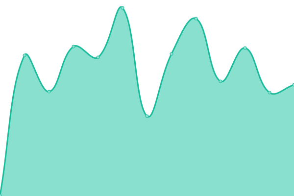
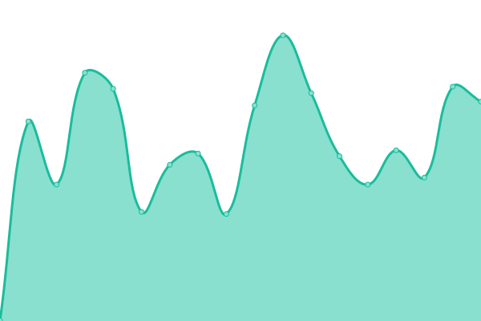
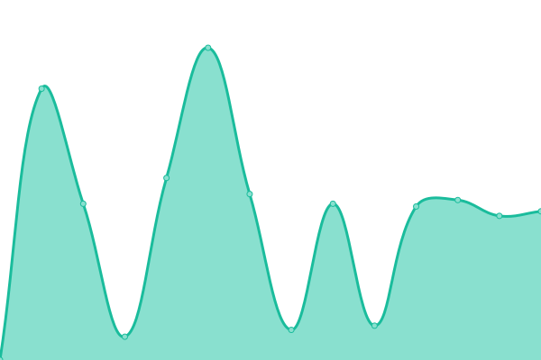
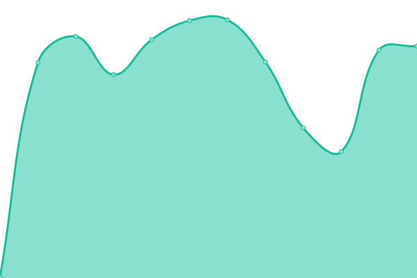
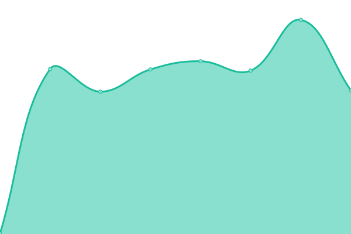
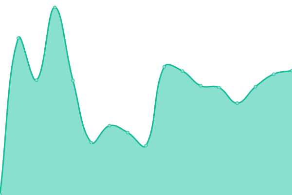

# [📈 Live Status](https://status.envesko.com): <!--live status--> **🟩 All systems operational**

<!--start: status pages-->
<!-- This summary is generated by Upptime (https://github.com/upptime/upptime) -->
<!-- Do not edit this manually, your changes will be overwritten -->
<!-- prettier-ignore -->
| URL | Status | History | Response Time | Uptime |
| --- | ------ | ------- | ------------- | ------ |
|  [Envesko Launchpad - HTTPS](https://envesko.com) | 🟩 Up | [envesko-launchpad-https.yml](https://github.com/envesko/status/commits/HEAD/history/envesko-launchpad-https.yml) | 

 288ms
     
 | 

<a href="https://status.envesko.com/history/envesko-launchpad-https">93.00%</a>
    

|  [Envesko Cloud - HTTPS](https://envesko.cloud) | 🟩 Up | [envesko-cloud-https.yml](https://github.com/envesko/status/commits/HEAD/history/envesko-cloud-https.yml) | 

 425ms
     
 | 

<a href="https://status.envesko.com/history/envesko-cloud-https">100.00%</a>
    

|  [Envesko Base - HTTPS](https://base.envesko.com) | 🟩 Up | [envesko-base-https.yml](https://github.com/envesko/status/commits/HEAD/history/envesko-base-https.yml) | 

 1482ms
     
 | 

<a href="https://status.envesko.com/history/envesko-base-https">93.34%</a>
    

|  201 (Shared - Web) - HTTPS | 🟩 Up | [201-shared-web-https.yml](https://github.com/envesko/status/commits/HEAD/history/201-shared-web-https.yml) | 

 266ms
     
 | 

<a href="https://status.envesko.com/history/201-shared-web-https">100.00%</a>
    

|  500 (Platform) - HTTPS | 🟩 Up | [500-platform-https.yml](https://github.com/envesko/status/commits/HEAD/history/500-platform-https.yml) | 

 354ms
     
 | 

<a href="https://status.envesko.com/history/500-platform-https">63.05%</a>
    

|  srv2 (External) - HTTPS | 🟩 Up | [srv2-external-https.yml](https://github.com/envesko/status/commits/HEAD/history/srv2-external-https.yml) | 

 237ms
     
 | 

<a href="https://status.envesko.com/history/srv2-external-https">93.34%</a>
    

|  600 (Shared - Game) - API | 🟩 Up | [600-shared-game-api.yml](https://github.com/envesko/status/commits/HEAD/history/600-shared-game-api.yml) | 

 226ms
     
 | 

<a href="https://status.envesko.com/history/600-shared-game-api">63.05%</a>
    

|  602 (Managed - Game) - API | 🟩 Up | [602-managed-game-api.yml](https://github.com/envesko/status/commits/HEAD/history/602-managed-game-api.yml) | 

 218ms
     
 | 

<a href="https://status.envesko.com/history/602-managed-game-api">63.05%</a>
    

|  905 (Managed - Web) - HTTPS | 🟩 Up | [905-managed-web-https.yml](https://github.com/envesko/status/commits/HEAD/history/905-managed-web-https.yml) | 

 227ms
     
 | 

<a href="https://status.envesko.com/history/905-managed-web-https">64.49%</a>
    

<!--end: status pages-->
